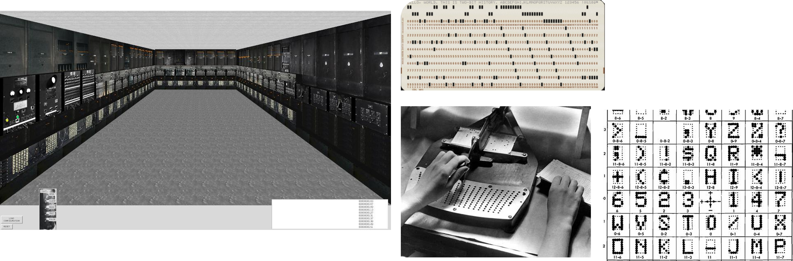
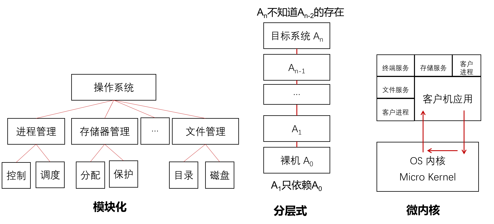

## 第一章  课程介绍与操作系统引论

*XSUN@GZHU
2026/08/20*

---

### 为什么学习操作系统 - Why
- 重新认识每天陪你最多的东西：手机+计算机
- 构建计算机运行的底层逻辑，对底层逻辑的认识是一切创新的开始
    - $\to$ 第一性原理，获得一种“穿透层层抽象，直抵核心”的掌控感
- 提高你的计算机编程能力: 面向硬件编程，代码才能飞得更快
    - $\to$ Codex/ClaudCode: 交给我吧！AI时代，什么是核心竞争力？
    - $\to$ DeepSeek/ChatGPT: 我全都会！AI时代，还需要学习吗？
- 享受课堂，享受作业，这些都是活着的一部分，是我们彼此存在的方式
- 考研，计算机相关专业408：计算机组成原理/操作系统/数据结构与算法/计算机网络
- 不要为了分数而内卷，而沾沾自喜，要变得更强，真正的强，才有底气！

### 如何学习操作系统 - How
- 学术诚信 Academic integrity：不可以抄袭 ~~别人~~ (AI) 的代码完成实验和作业，真正**会用**AI。
    - 作业/实验报告均需填写：AI工具使用说明
- 学会寻求帮助：AI(会用), STFW/RTFM, 你的同学/老师
- Vibe Coding：你甚至可以写一个可运行的操作系统(实验课只是概念抽象)

- 参考资料：
    - [南京大学JYY计算机系统基础：Introduction · GitBook](https://nju-projectn.github.io/ics-pa-gitbook/ics2021/index.html)
    - [MIT 6.S081: Operating System Engineering](https://pdos.csail.mit.edu/6.828/2021/schedule.html)
    - [哈尔滨工业大学李治军：操作系统](https://www.bilibili.com/video/BV19r4y1b7Aw)
    - 《操作系统真象还原》郑钢 人民邮电出版社
    - 《Operating Systems - three easy pieces》Remzi Arpaci-Dusseau and Andrea Arpaci-Dusseau 
> Learn OS concepts by coding them！ – Stanford OS Course

> I hear and I forget. I see and I remember. I do and I understand.  -OSTEP 

计算机作为人类文明最重要的发明之一，操作系统是不可或缺的组成部分，让我们一起感受人类伟大的计算机工程师们的智慧与理性之光，开启操作系统学习之旅吧！

### 什么是操作系统 - What
当我谈到操作系统时，你想到的可能是：Windows, MacOS, Linux等等。你可能想到的是自己曾经安装系统和操作电脑时的场景，但你真的感受过操作系统的存在吗？你想象过如何没有操作系统你的计算机会怎么样吗？另外，你真的清楚计算机开机后的流程吗？

对于以*Intel80x86*为CPU的计算机来说，从上电后流程大致为：
```
Power ON -> BIOS POST -> BIOS load MBR to RAM[0x7c00] -> MBR load Kernel and jmp to Kernel -> OS
```
其中：
- BIOS： Basic Input/Output System，是一段存储在ROM中的程序
- POST：Power On Self-Test
- MBR：Master Boot Record, 磁盘第一个扇区的512Byte，以`0x55aa`结束
- Kernel: 内核，存在外存(硬盘/U盘)上的程序，这就解释为什么一个机器可以安装多个系统，你可以选择启动哪个系统

内核初始化完成后，操作系统接管计算机，但本质是进入一个死循环，等待任务。所以你说**操作系统是一个死循环**是完全正确的。任务到来后通过操作系统通过 **中断(interrupt)** 的方式来响应。

但是，究竟操作系统是什么呢？

其实，现在问这个问题还为时尚早。但我相信课程结束后，你一定有自己的理解和回答。

这里，我们先只给一种宽泛的说法，让它成为一颗种子，在你心中生根发芽！

我们先看看OSTEP中是如何定义的：

> There is a body of software, in fact, that is responsible for making it easy to run programs (even allowing you to seemingly run many at the  same time), allowing programs to share memory, enabling programs to  interact with devices, and other fun stuff like that.     -OSTEP 

这个定义似乎在用概念解释概念，我们依然有很多问题：
1. it 是指 computer, 但什么是computer?
2. run 的对象是 program，但什么是 program?
3. program 还可以 share memory, interact with devices?
4. fun stuff? 有多fun? :smile:

但是，这个定义至少告诉我们操作系统是一个软件(a body of software)! 我们再来看看教材上的定义：

> 操作系统(Operating System，OS)是配置在计算机硬件上的第一层软件，是对硬件系统的首次扩充。其主要作用是管理好这些设备，提高它们的利用率和系统的吞吐量，并为用户和应用程序提供一个简单的接口，便于用户使用。

所以，操作系统是管理硬件，提供硬件利用率，为用户和应用程序提供接口？
- 浏览器是不是操作系统？
- 机房是不是操作系统？

虽然，我们对一些细节还不太清楚，但我们似乎感觉到了，对于计算机，操作系统似乎是不可或缺的，它好像让计算机更容易被使用，所以我们把这句话放在心中：

> 操作系统让计算机更美好（eaiser to use）！

带着这句话让我们看看操作系统的历史，从历史的角度观察操作系统是如何一步步让计算机更美好的！

### 操作系统发展历史
世界上第一台计算机是诞生于1946年情人节的[ENIAC](https://www.cs.drexel.edu/~bls96/eniac/simulator.html)(Electronic Numerical Integrator And Computer) 



它使用真空管作为逻辑门(那时候还没有CMOS)，使用延迟线作为内存(那时候也没有SRAM/DRAM/FLASH等存储技术)，输入输出全靠打孔纸带(没有键盘，更没有触摸屏)。它没有任何操作系统，因为它不需要。程序需要人手动打孔脱机输入，非常机械和繁琐！

程序输入1小时，1分钟执行完，CPU利用率极低！

#### 操作系统的诞生与发展
为了提高CPU的利用率，并适应1960s以后，计算机开始向着更快的处理器、更大的内存，更丰富的IO设备发展趋势，批处理系统诞生了。1962年9月IBM推出7090/7094大型机搭载IBSYS批处理系统，允许用户一次性提交很多作业，系统自动一个一个运行，于是操作系统第一次明显承担起：自动组织计算工作流程。

但是CPU相对于磁盘还是很快，所以为了进一步提高CPU利用率，让售价290万美元的机器充分利用，1964年IBM推出多道批处理系统OS/360，如果A作业需要等待I/O，那么CPU就去执行B作业，不用空等A作业的IO完成，这将带来CPU利用率的显著提升。

但是，当时用户的体验可能是：
```
上午提交程序 -> 下午拿到结果 -> 发现写错一个符号 -> 修改后重新提交 -> 结果等明天
```
这种交互体验式很糟糕的，所以出现新的需求：我希望像使用终端一样，直接和计算机交互。

由此产生了**分时系统(Time sharing)**，思想是一个昂贵CPU供几十个用户终端使用，每个用户：
```
User A  20 ms
User B  20 ms
User C  20 ms
...
```
每个人感觉：“好像我自己拥有一台计算机。” 1965年MIT、Bell Labs 和 General Electric 合作开发 Multics 分时系统，实现了多用户，任务切花，资源复用的思想，这些思想极大地影响现代操作系统。Multics还期望把计算机做成一种人人可用的公共设施，所以软件越做越庞杂，难以维护。并且，1980s以后个人电脑(PC-Personal Computer)开始兴起，为了适应个人使用电脑的新需求，曾参与过Multics开发的Ken Thompson、Dennis Ritchie(C语言之父)合作于1969年开发了Unix，他们的目标只有一个：

> 想要一个自己能方便使用的交互式计算环境

Unix的核心思想有两个：
1. everything is a file
2. 小程序 + pipe组合

这体现了重要的工程哲学：
> 提供简单通用的机制，让用户自由组合。

到目前为止，操作系统都是用汇编语言编写，可移植性很差，后来Dennis Ritchie发展了C语言，就用C重构了Unix，开启了操作系统跨机器移植的大门，让Unix很快传播到大学和研究机构。

其中，就有Andrew Tanenbaum教授为了讲解OS，1987年把Unix简化成了教学版Mini，采用了微内核Microkernel结构，这和传统Unix的monolithic kernel形成对比。

Unix虽然好，但是软件受许可证限制，为了让更多普通用户能够使用Unix, Richard Stallman 在 1983 年启动了GNU Project。这个GNU是递归首字母缩写(recursive acronym)：
```
GNU is Not Unix
```
意思就是说我们要开发一个开源可用的`Unix-like OS`但不是那个Unix! 于是GNU开发了大量的基础设施，比如：`GCC, Bash, make, GNU assembler, GNU linker...`，但是它的内核一直不够完善。

历史总是很巧合，这时候 Linus Torvalds为自己的 386 写了一个能够使用机器能力的操作系统内核，这就是Linux内核，这正好填补了GNU的空缺，于是：
```
Linus Kernel + GNU userland -> GNU/Linux
```
于是一个开源的Unix-like操作系统就此诞生！

随着互联网的兴起，发生了一件非常重要的事情：
> Internet + 自由软件许可证，使操作系统第一次可以由全球开发者协作演化。

随着个人电脑的不断发展和普及，计算机已经不再是专业人员特有的设备，普通用户也开始使用计算机，这就带来了新的需求：
> 不是让几十个人共享一台机器，而是让一个普通人方便地使用自己的机器。

于是：
- 图形用户界面Graphic User Interfacte-GUI
- 鼠标
- 桌面
- 图标icon 与 窗口window
 
成为新的发展主线，这也成就了苹果Apple和微软两家公司：
```
Apple: UNIX -> Lias OS(First GUI, 1983) -> MacOS (1984)
MS: Windows 1.0 (1985) -> Window NT (1993) -> ....
```
#### 微软的发家史
说到计算机进入个人爱好者市场，我们来讲讲Bill Gates是怎么发家的:sunglasses:~

第一个微型计算机应该是1974年诞生的Altari 8800, Paul Allen 和 Bill Gates第一次看到Altari时并没有说要写个操作系统，而是为它开发了一个可以方便用户为其编程的BASIC解释器，然后靠这个解释器于1975年成立了Microsoft！随后，1977年还开发了FAT文件分配方法。

但是另一边，1970年代后半期，个人电脑最流行的操作系统是Digitial Research公司开发的CP/M！

这时候大型机市场的巨人IBM想要进军PC市场，为了刚上PC市场的快速变化，IBM改变了以往什么都是自己造的策略，变成能买现成的，就不自己造。于是：
- CPU：买了Intel的8088 (16bit 内部总线，8位外部总线)
- BASIC：找MS买
- 操作系统：找DR买CP/M？？

但是IBM和DR谈崩了！于是他们又找回MS，Bill Gates说我来做，但是内心很慌。但是MS从 Seattle Computer Products 得到 86-DOS，适配后交给 IBM。1981 年 IBM PC 发布，IBM 无意间创造了一个开放程度很高的 PC 兼容生态，而微软又**聪明地保留了 DOS 对其他厂商的授权权**。结果 IBM PC 越成功，兼容机越多，MS-DOS 的市场反而越大。随后 PC 从软盘走向硬盘，DOS 2.0 增加目录和硬盘支持；PC 从程序员工具走向普通大众，又推动 Windows 图形界面诞生。最终 DOS 完成历史使命，微软则从‘卖 BASIC 的小公司’，借 IBM PC 的浪潮成为了 PC 软件平台公司。

所以：
>IBM 赢了 PC 的第一场战役，却帮助微软建立了一个比单台 IBM PC 更大的软件平台。

#### 操作系统发展的必然性

- IBSYS → OS/360 → Multics：OS越来越复杂是为了提高计算机资源利用率和用户体验
- Multics → Unix → MINIX → Linux/GNU：微型机，PC的出现与普及，教学、体系结构与开放源码
- DOS → Window / Unix → MacOS: PC的普及和PC用户的变化

#### 实时操作系统
今天，OS要面对更多的设备和资源（GPU,SSD,网卡），面对更复杂的应用和需求，对于一些特殊场景，如工业控制，军事武器，多媒体，智能手表，物联网，汽车等，需要操作系统能够及时响应外部事件，再规定时间内完成处理。这就是实时操作系统，他和分时操作系统的主要区别：

| 对比维度  | 分时操作系统 Time-sharing OS   | 实时操作系统 RTOS                |
| ----- | ------------------------ | -------------------------- |
| 核心目标  | 公平共享 CPU，提高交互体验          | 保证任务在截止时间前完成               |
| 关注指标  | 平均响应时间、吞吐量、公平性           | 最坏情况响应时间、确定性、deadline      |
| 调度思想  | 时间片轮转、动态优先级、公平调度         | 优先级抢占、周期任务调度、EDF/RM 等      |
| 时间要求  | “尽快”即可                   | “必须在规定时间内”                 |
| 延迟波动  | 可以有一定抖动                  | 必须尽量可预测、可界定                |
| 任务优先级 | 通常兼顾公平，防止某任务长期独占         | 高优先级实时任务可压倒低优先级任务          |
| 中断处理  | 重视性能，但允许一定延迟             | 中断延迟要求严格、通常必须有上界           |
| 内存管理  | 可使用分页、交换、虚拟内存等复杂机制       | 常避免不可预测的缺页、交换等机制           |
| 典型场景  | Unix/Linux 桌面、服务器、多用户终端  | 工业控制、汽车 ECU、飞控、机器人、医疗设备    |
| 典型系统  | Unix、Linux、Windows、macOS | VxWorks、QNX、FreeRTOS、RTEMS |

也就是说：
```
分时系统：
“请让我感觉机器一直在响应。”

实时系统：
“必须在 5 ms 以内完成。”
```
系统设计和优化的目标是不同的！

#### 操作系统结构设计
从工程设计的角度，看待操作系统，历史上出现过如下的结构：
1. 无结构，如早期的相对简单的单道批处理系统
2. 模块化设计，如Unix
3. 分层式设计，每一层只知道上一层的存在，其余不关心
4. 微内核，将部分系统服务设计成客户机应用，形成客户/服务器模式，如minix系统
后三种结构的示意图如下：



### 操作系统的功能与特点
为了更直观的感受操作系统的功能，我们用一个C程序为例来体会。

对于如下C程序(这就是一个program)：
```c
// source/hello.c
#include <stdio.h>
int main() {
    printf("Hello World\n");
    return 0;
}
```
如何让一个已装有操作系统的计算机执行这个程序？

我们知道计算机只认识二进制机器码，所以要先转化成机器码，这个过程叫做：编译-汇编-链接：
```shell
gcc hello.c -o hello_c
```
然后执行：
```bash
./hello_c
```
这样，在终端上就会打印：
```
Hello World
```
这是C语言的老师教给你们的，也是符合我们期待的，但是这个过程中到底发生了什么？

##### C程序到机器码
上面的过程其实可以进行拆分：
```bash
# 预处理
gcc -E hello.c hello.i | less

# 汇编
gcc -S -O0 -fno-builtin -masm=intel hello.c -o hello.s

# 编译
gcc -c hello.c -o hello.o

# 链接
gcc hello.o -o hello_c
```
让我们先来看看`hello_c`里的内容：
```
ls -lh hello.c hello_c
file hello_c
xxd -g 1 -l 64 hello_c
```
你会发现，一个小小的C程序本来76B，变成可执行文件后有16K之多！而且可执行文件是一个ELF文件。

这个C程序调用了`printf()`这个函数，而它定义在动态链接库中：
```bash
ldd hello_c
readelf -l hello_c | grep -A5 INTERP
```
然后你会发现C程序汇编之后调用了这里：
```nasm
call  printf@PLT
```
也就是说，目前我们追溯到的流程为：
```
printf (.c) -> print@PLT (.s) -> lib -> ? 
```
让我们再追踪一下：
```
strace ./hello_c
```
我们发现含有`Hello World`的行为：
```
write(1, "Hello World\n", 12) = 12
```
也就是说lib调用了`write`来实现`printf`。这个`write`就是**系统调用System Call**，这就是操作系统提供给应用程序的接口！所以：
```
printf (.c) -> print@PLT (.s) -> lib -> write (syscall) -> OS kernel
```
Linux 的 `write()` 系统调用将一段 buffer 中的数据写到指定文件描述符 (file descriptor, fd=1, 指向标准输出)所引用的对象。

##### 汇编程序的执行
也许这一大堆事情都是 C 和 printf 搞出来的。那我们不用 C 库，直接写汇编怎么样？

我们写一个如下的汇编程序：
```nasm
; source/hello.asm
global _start

section .data
    msg db "Hello World", 10
    len equ $ - msg

section .text

_start:
    mov rax, 1
    mov rdi, 1
    lea rsi, [rel msg]
    mov rdx, len
    syscall

    mov rax, 60
    xor rdi, rdi
    syscall
```
然后编译成目标文件，再链接成可执行文件：
```bash
nasm -f elf64 hello.asm -o hello.o
ld hello.o -o hello_asm
```
运行`hello_asm`也可以正常打印。用`strac`观察它的运行过程非常简单，
```
_start -> syscall -> OS Kernel
```
汇编程序本质是调用了`syscall`来写终端(其实也就是`write(1, "Hello World", 12)`)，参数依次存在寄存器中：
- `rax <- 1`, 系统调用号，write 对应为1
  - 查看x86架构的系统调用号：[x86_syscall](https://github.com/torvalds/linux/blob/master/arch/x86/entry/syscalls/syscall_64.tbl?utm_source=chatgpt.com)
- `rdi <- 1`，目标文件的fd=1，表示标准输出
- `rsi <- msg相对地址`，所写字符串buffer的起始地址
- `rdx <- msg长度`, 所写字符串的长度

那么请问，如果没有操作系统，这个汇编程序可以运行吗？

答案是不能，因为这些寄存器中的值如何解释，数值如何对应具体的硬件，都是Linux系统内核定义的！

当我们运行`./hello_c`的时候，有很多事情需要决定：
```
1. 找到 executable file
2. 识别 ELF format
3. 建立 process execution environment
4. 建立 virtual address space
5. 映射 code / data / stack
6. 如果动态链接，装入 dynamic linker / libraries
7. scheduler 让这个 process 获得 CPU
8. CPU 在 user mode 执行代码
9. syscall
10. kernel 完成 I/O
11. process exit，OS 回收资源
```
这都是操作系统的任务，也就是操作系统所提供的功能，归纳一下就是：
```
Process
    → 进程管理、CPU Scheduling

Memory
    → Virtual Memory

File Descriptor
    → File System

write()
    → System Call

TTY / Device
    → I/O & Device Management

User / Kernel mode
    → Protection
```

因此，要想搞清楚操作系统是什么，其实就是搞清楚，操作系统如何进行：
- 进程管理：本质是CPU管理，合理分配CPU时间，提高CPU利用率和用户体验
- 内存管理：合理分配内存空间
- 磁盘/文件管理：合理分配外存空间，提升用户体验
- I/O管理：用户程序可以方便地访问外设：键鼠，显示器等
- 系统调用：为应用程序提高硬件接口
- 安全：保护关键数据
- *其他现代要求：网络，多媒体，图形界面

如果你翻开课本的目录，发现内容可以完全对应章节。

正因为操作系统以这些功能为其主要设计目的，也就从根本上决定了操作系统的特点：
- 并发性：分时系统，多个程序并发运行
- 共享性：共享CPU，共享内存，共享IO
- 虚拟性
  - 时间：每个程序似乎独占CPU时间
  - 空间：每个程序似乎拥有整片内存
- 异步性：程序之间的交互，I/O交互

所以下一次提到操作系统，你的心中要有这些关键词！

学习操作系统并不是一件简单的事情，我们要用一个学期来回答操作系统究竟是什么。


