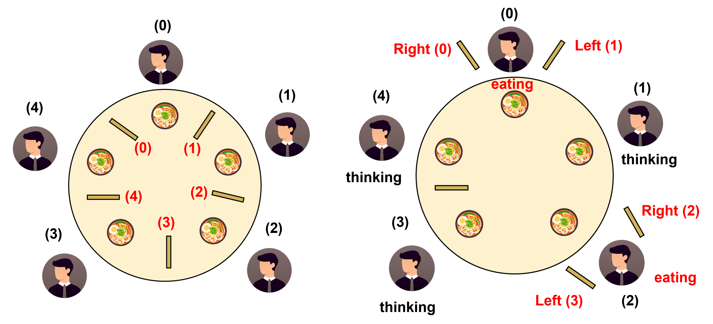

## 第二章  进程管理
*XSUN@GZHU
2026/09/02*

---
上一章结尾我们从一个`hello_c`程序的运行看到了操作系统如何支持用户通过程序使用计算机的。事实上，如今运行在计算机上的各种应用，包括Word, Excel, 大型3D游戏，浏览器，Codex客户端等等，其本质不过只是一个比`hello_c`复杂一些的程序而已。

本章我们澄清究竟什么是程序，什么是进程(包括什么是线程)，然后观察分时操作系统如果要支持多程序的同时运行(并发-concurreny)，又要解决哪些问题，并理解这些问题时如何被解决的。

如此，我们便能理解操作系统进程管理中的诸多概念，不能死记硬背这些概念，而要从工程的角度理解他们出现的必然性！

### 程序-线程-进程
本章的标题是进程管理，那我们首先要明白什么是进程？

它是Windows任务管理器中显示的内容，还是Linux中`top`命令的输出？

要想理解什么是进程，我们首先要理解什么是程序？

#### 程序 Program
`hello.c` 和 `hello_c` 是程序吗？

- `hello.c` 是C语言代码文件，不是程序！
- `hello_c` 是程序!

程序本质是一个可执行文件，里面主要保存：CPU将来需要执行的机器指令、数据和一些运行配置信息。所以，程序本身不会“运行”，它只是磁盘上的一堆字节。

当我们执行(或者在Windows中双击`.exe`)：
```bash
./hello
```
时，一个程序才正在"运行"了起来！而所谓的运行起来：
- 从硬件角度看：CPU取指令执行指令的过程
- 从软件角度看：操作系统中的一个"运行世界"

《计算机组成原理》会让你深刻理解上面的硬件视角，而操作系统课程将从软件视角带你触碰这个程序的"运行世界"！

为了更清晰地看到这个"运行世界"，我们先从一个具体的例子深入地理解一下程序的运行现场。

##### 执行现场
对于如下C程序：
```c
int add(int x, int y)
{
    int z = x + y;
    return z;
}

int main()
{
    int a = 10;
    int b = 20;
    int c = add(a, b);
    int d = b - a;
    return 0;
}
```
调用`add()`前需要记录当前执行到的地址`addr`，调用完后需要让程序指针`PC(RIP)`再指向`addr`，从而回到`main()`调用前的位置继续执行。此外，除了返回地址，我们还要保存调用参数`a`和`b`，以及`main()`和`add()`的执行现场，其中包含着他们各自的局部变量，寄存器状态等。

那这些信息又是如何保存的呢？我们来看一个更复杂的例子：
```c
// source/concept/call.c
#include <stdio.h>

void B(void)
{
    int b = 20;
    printf("B: &b = %p\n", (void *)&b);
}

void A(void)
{
    int a = 10;
    printf("A: &a = %p\n", (void *)&a);
    B();
}

int main(void)
{
    int m = 0;
    printf("main: &m = %p\n", (void *)&m);
    A();
}
```
考察这个程序的调用和返回顺序，我们发现：
- 调用顺序：`main() – A() – B()`
- 返回顺序：`B() – A() – main()`

也就是说，最先调用的最后返回，具备"后入先出-Last In First Out"也就是LIFO的特性，这恰恰暗合了一种重要的计算机数据结构—— **栈(stack)** 的特点！因此，我们使用 **栈(stack)** 这种数据结构来保存函数调用和返回的现场！

栈的物理本质就是一片内存区域，只不过它遵循后入先出的准则，我们使用：
- `push`:向栈中存入一个数据
- `pop`:从栈中弹出一个数据
- `rsp`寄存器记录栈顶指针（栈顶的内存地址）

并且，x86规定栈向低地址增长，例如，初始化栈顶为`rsp=0x1000`：
```
rsp -> 0x1000 : 0x0000
```
执行：`push 0x10`, `push 0x55`后，栈变成：
```
       0x1000 : 0x00
       0x0fff : 0x10
rsp -> 0x0ffe : 0x55
```
再执行`pop ax`后，寄存器ax中的值为`0x55`，且栈变为：
```
       0x1000 : 0x00
rsp -> 0x0fff : 0x10
```

我们可以运行上述编译和运行上述程序，观察每个函数中的局部变量的内存地址：
```bash
gcc -O0 call.c -o call
./call
```
典型输出：
```
main: &m = 0x7ffed0f88134
A: &a = 0x7ffed0f88114
B: &b = 0x7ffed0f880f4
```
你会发现：`&m > &a > &b`，与我们的函数调用顺序一致！这也证明每进行一次函数调用，栈都会增长，因为存储在栈上的局部变量的地址在变小(栈向低地址增长)!

因为每一次函数调用的现场（调用参数，局部变量，寄存器，返回地址等）都保存在栈上，所以我们称之为一个"栈帧 stack frame"！

我们可以使用`gdb`([GNU Project Debugger](https://sourceware.org/gdb/))来查看调用栈（需要`gcc`保留栈帧信息）：
```
gcc -O0 -g -fno-omit-frame-pointer call.c -o call_frame
gdb ./call_frame
```
然后我们在`gdb`中可以看到函数的调用现场和栈帧：
```
break B
run
bt 
```
典型输出
```
#0  B () at call.c:4
#1  0x00005555555551ff in A () at call.c:13
#2  0x0000555555555258 in main () at call.c:20
```
还可以看寄存器和局部变量信息：
```
p $rsp
info registers rsp rax
info locals
```
由此，我们便看到：栈就是CPU在执行程序时保存函数调用现场的真实机制！

##### 执行流
那现在问个问题：
> 假设程序当前运行到 B()。那么要描述“这个程序现在执行到哪里”，最少要知道什么？

由上面的知识，我们明白要恢复`B()`的现场，我们要知道：
- PC / RIP：当前执行到哪条指令了？
- Registers: CPU寄存器的状态
- RSP：当前的栈在哪里？
- stack: 函数调用历史和局部状态

我们可以称以上现场信息为**执行流**：一套可以独立继续执行下去的 CPU 状态。

现在想象一个复杂一些的程序（应用），一个聊天软件：
```c
while (1) {
    等待用户输入;
    接收网络消息;
    刷新界面;
    保存文件;
}
```
这个应用一定不能因为一直等待用户输入，就卡住！所以，自然的想法是：
```
执行流 1：处理界面
执行流 2：接收网络
执行流 3：保存文件
```
也就是：一个运行中的程序，希望存在多个可以独立推进的**执行流**。操作系统把这种执行流抽象成一个概念：**线程（Thread）**。

#### 线程Thread
有了线程的概念，我们就可以把聊天应用抽象成一个多线程应用：
```c
// global vars;
// global files;
int main()
{
    while(1)
    {
        thread1("处理用户输入");
        thread2("界面渲染");
        thread3("处理用户输入");
        thread4("文件处理");
    }
}
```
每个线程都是一个独立执行流，所以每个线程都需要有：PC/RIP, 寄存器，RSP和stack, 但是它们都处于同一个程序中，所以，可以共享：
- 程序代码
- 已初始化的全局数据
- 打开的文件
- 堆Heap (存储程序运行之后的动态数据)

所以，这个多线程程序的模型可以表示为：
```
┌───────────────────────────┐
│            Code           │
├───────────────────────────┤
│        Global Data        │
├───────────────────────────┤
│            Heap           │
├───────────────────────────┤
│ Stack 1        Stack 2    │
│   ↓              ↓        │
│ Thread 1       Thread 2   │
│ PC/Regs        PC/Regs    │
└───────────────────────────┘
```
我们可以用一个多线程示例来看，线程之间共享了什么，而什么是独立的：
```c
// source/concept/thread.c
#include <stdio.h>
#include <stdlib.h>
#include <pthread.h>
#include <unistd.h>

int global = 100;
int *heap;

void *worker(void* arg)
{
    int local = 0;
    printf("Thread:\n");
    printf("  &global = %p\n", (void *)&global);
    printf("  heap    = %p\n", (void *)heap);
    printf("  &local  = %p\n", (void *)&local);
    return NULL;
}

int main(void)
{
    pthread_t t1, t2;
    heap = malloc(sizeof(int));
    pthread_create(&t1, NULL, worker, NULL);
    pthread_create(&t2, NULL, worker, NULL);
    pthread_join(t1, NULL);
    pthread_join(t2, NULL);
    free(heap);
    return 0;
}
```
编译运行：
```bash
gcc -O0 -g thread.c -o thread -pthread
./thread
```
典型输出：
```
Thread:
  &global = 0x5677113eb010
  heap    = 0x567723aea2a0
  &local  = 0x75b35d5fde44
Thread:
  &global = 0x5677113eb010
  heap    = 0x567723aea2a0
  &local  = 0x75b35ddfee4
```
你会发现，每个线程的`local`是存在自己的栈帧上的，所以地址不同，而global和heap是共享的。

而这个让他们共享这些数据和资源的实体，也就是我们开头提到的"运行世界"，就是**进程Process**！

#### 进程 Process
线程之间可以共享全局数据，因为它们本质上存在于进程之中。

那进程之间可以共享数据吗？因为它们存在于同一个OS之中？

简单思考一下，也知道，进程之间必须隔离。不然你在Offic Word中就可以操作浏览器了:smile: ！并且，进程隔离可以保证：一个进程出错了，不会影响其他进行，更不会影响你的计算机。

> 所以，操作系统一定要让进程之间隔离。

为了演示，我们在Linux中运行下面的程序：
```c
// source/concept/isolate.c
#include <stdio.h>
#include <stdlib.h>
#include <unistd.h>
int x = 0;
int main(int argc, char *argv[])
{
    if (argc != 2) {
        printf("usage: %s number\n", argv[0]);
        return 1;
    }
    x = atoi(argv[1]);
    
    while (1) {
        printf("x=%d\n",x);
        sleep(2);
    }
}
```
我们可以运行多个上述程序：
```
gcc isolate.c -o isolate
./isolate 1111
```
然后另一个终端运行：
```
./isolate 2222
```
两个程序运行，发现变量`x`的值是不同的。

在操作系统的加持下：运行的是同一个程序，却产生了相互独立的不同进程。这再一次体现出了程序只是静态的文件，而进程是动态的"运行世界"！而这个运行世界，包含了如下内容：

- 程序代码
- 数据
- 堆
- 打开的文件
- 若干线程
  - registers
  - rip
  - rsp
  - stack
- ...

这便是"进程"在操作系统里真正样子(的一部分)！因为后面还有省略号，随着我们学习的深入，这些省略号也会慢慢有具体的内容！敬请期待~ :grin:

好了，到这里，我们总结一下：

| 概念      | 最核心的问题      | 本质      |
| ------- | ----------- | ------- |
| Program | 要执行什么？      | 静态代码与数据 |
| Process | 资源属于谁？和谁隔离？ | 资源与隔离容器 |
| Thread  | 谁在执行？       | CPU执行流  |

所以：
> Program  = 要执行的代码
> Process  = 程序运行所处的资源与隔离环境
> Thread   = 这个环境中真正向前执行的执行流

它们的关系，也可以总结为下图：


### 并发 Concurrency
理解了进程之后，我们知道，分时操作系统允许用户“同时”运行多个进程，这个打印好的同时，就是并发Concurrency。

> PS: 并发Concurrency和并行parallelism 是有区别的。并行，才是真正意义上的"同时发生"(多核系统)，而并发，只是看起来像是同时发生，实际上CPU在每个时刻只能执行某个进程的指令。

我们甚至可以从同一个程序来产生不同的进程，比如我们之前测试所用的`./isolate`：
```
./isolate 1111 &
./isolate 2222 &
```
在Linux系统中，我们可以用`ps`命令来获得进程信息：
```
ps aux | grep isolate
```
典型输出：
```
sxl   345460  268960  0 22:04 pts/6    00:00:00 ./isolate 2222
sxl   345501  343149  0 22:04 pts/7    00:00:00 ./isolate 1111
```
我们之前讲过，这两个进程是完全独立的，它们都不知道彼此的存在。我们来修改一下程序，进一步体会这种独立性：
```c
// source/concept/isolate_memory.c
#include <stdio.h>
#include <stdlib.h>
#include <unistd.h>
int x = 0;
int main(int argc, char *argv[])
{
    if (argc != 2) {
        printf("usage: %s number\n", argv[0]);
        return 1;
    }
    x = atoi(argv[1]);
    printf("&x  = %p\n", (void *)&x);
    while (1) {
        printf("x=%d\n",x);
        sleep(2);
    }
}
```
其实这个代码之比，`isolate.c`多了一句话：
```c
printf("&x  = %p\n", (void *)&x);
```
就是打印变量`x`的地址。

同样使用`gcc`编译，但是注意要加上`-fno-pie`参数让其不要生成位置无关可执行文件所需的代码, `-no-pie`在链接阶段不要生成那种可以被 Linux 动态加载器随机放置的可执行文件：
```
gcc -O0 -fno-pie -no-pie isolate_memory.c -o isolate_memory
```
运行发现，两个程序`x`的地址完全一样！

看着不合理，实际上这个地址是虚拟地址，不是真正的内存物理地址！这里先埋个伏笔，我们在内存管理再来打开它！

由上面的实验可以发现：OS中多进程是完全隔离的，这保证了系统的安全！但如果进程之间真的想要**合作**怎么办？比如：
```bash
cat data.txt | grep error
```
`cat`和`grep`是不同的进程，但是我们却需要他们之间合作完成一个更复杂的任务。这就涉及到操作系统中一个很重要的问题——**IPC: Inter-Process Communication**：操作系统如何为进程间的合作提供支持？

### IPC
Linux为进程间的合作提供了多种方式：
1. pipe
2. shared memory
3. message queue
4. signal
5. ...

本质上可以分成两大类：**通信 Message passing**与**共享内存 shared memory**。我们刚才用到的：
```bash
ps aux | grep
```
就属于进程**通信**中的**管道pipe**，它的实现示意：
```
 ps                           grep
 │                             ⭡
 │ write                       │ read
 ↓                             │
┌───────────────────────────────────┐
│             Pipe                  │
└───────────────────────────────────┘
```
因此，IPC机制为本来相互隔离的进程，提供了“合法穿过隔离边界”的通道。我们可以使用python非常方便使用OS为我们提供的管道功能：
```py
import os
r, w = os.pipe()
pid = os.fork() # 创建一个子进程
if pid > 0:
    os.close(r)
    os.write(w, b"Hello from parent!") # 父进程写
    os.close(w)
else:
    os.close(w)
    data = os.read(r, 100) # 子进程读
    print(f"Child received: {data.decode()}") 
    os.close(r)
```
> 注：上述程序只能在Unix上执行，Windows上没有`fork()`系统调用，运行会报错。

这体现了操作系统的设计哲学：

> 默认隔离，显式合作。也就是：受保护的独立性 + 受控制的合作。

那么，对于**共享内存**的这种合作方式呢？比如进程A和进程B都要更新一个变量`counter=100`：
```c
counter = counter + 1
```
能否保证最后`counter=102`？我们来验证一下这个问题。如何验证呢？

事实上，我们可以使用`mmap`这个系统调用来实现共享内存，但是过于复杂。其实，我们有一个天然合适的平台来实验这种共享变量的同时更新问题！没错，就是线程！因为，线程共享全局变量！我们来写一个这样的多线程程序：
```c
// source/mutual_exclusion/sum.c
#include<stdio.h>
#include<pthread.h>

#define N 1000000
long sum = 0;

void *Tsum(void *arg) {
    for (int i = 0; i < N; i++){
        sum++;
    }
}

int main(){
    pthread_t tA, tB;
    pthread_create(&tA, NULL, Tsum, &sum);
    pthread_create(&tB, NULL, Tsum, &sum);
    pthread_join(tA, NULL);
    pthread_join(tB, NULL);
    printf("sum is %ld\n", sum);
}
```
编译和运行上述程序（运行10次），
```bash
seq 10 | xagrs -I {} ./sum
```
会发现`sum`的值不是期待的`2,000,000`，而是比其要小，这是为什么？

因为`sum`被两个线程“同时”读写，会发生：
| 时刻 | Thread A      | Thread B      | sum |
| -- | ------------- | ------------- | --: |
| 1  | load sum → 10 |               |  10 |
| 2  |               | load sum → 10 |  10 |
| 3  | add → 11      |               |  10 |
| 4  |               | add → 11      |  10 |
| 5  | store 11      |               |  11 |
| 6  |               | store 11      |  11 |

看上去加了2次，实际上`sum=11`。这就是当不同线程(甚至进程)共享
同一个数据时，会发生:**竞争条件(race condition)**，结果依赖于**不可预测的执行交错**。

为了保证一组操作执行时不被其他线程并发执行，我们把这段代码称为 **critical section（临界区）**。把被临界区访问的数据（内存）叫做**临界资源Critical Resource**。临界区就是操作系统为了让进程正确地共享临界资源需要真正关心的地方！

那么，如何实现正确地访问临界资源呢？这需要OS保证不同临界区能够**互斥mutual exclusion** 地访问临界资源！

### 互斥-Mutual Exclusion
如何实现互斥，已让`sum.c`正确输出`2000000`呢？朴素的想法是，线程A读写临界资源`sum`时，把它锁上，访问完了再把锁打开：
```c
int locked = false;

void *Tsum(void *arg) {
    for (int i = 0; i < N; i++){
        while (locked); //wait
        locked = true; //上锁🔒
        sum ++;
        locked = false; //解锁🔓
    }
}
```
我们试一试这样可行吗, 运行发现失败了，这是为什么呢？

因为全局变量`locked`也说临界资源，我们也无法保证其读写不被打断。如果：
```c
while(locked); 
locked = true; 
```
这两句需要一起完成，不能被打断，都在进程A,B可能都会跳过`while`循环。这种不能被打断(without interruption)的操作，我们称之为"**原子操作atomic operation**"。

想要保证操作是原子的，很困难，它需要硬件的支持(后面会说)，但是我们先从软件上看看有没有更好的方法来实现互斥呢？

#### Peterson 算法
这个算法的思想是针对A, B两个进程：
```
A：我要进临界资源(flag A)，但如果冲突让 B 先(turn = B)
B：我要进临界资源(flag A)，但如果冲突让 A 先(turn = A)
```
所以针对A的等待条件就是：
```c
while(flag B && turn==B);
```
因此，最后采写`turn`的进程，让出了优先权。实现的peterson算法见：[sum_peterson.c](./source/mutual_exclusion/sum_peterson.c)。我们运行一下，发现仍然没有得到我们想要的`2,000,000`! 

这说明Peterson算法是错的吗？不是，从C语言的逻辑语义上是正确的:

> Peterson 在它的计算模型里是正确的；但是普通 C 程序没有满足它依赖的计算模型。参加Peterson 1981年的[论文](https://zoo.cs.yale.edu/classes/cs323/doc/Peterson.pdf)~

Peterson 隐含两个非常重要的假设：
1. 对 `flag` 和 `turn` 的读写是原子的，不可分割！
2. 所有处理器看到的读写顺序与程序写出的顺序一致(循序一致性Sequential Consistency)，程序语义先后关系的保持！

但是现代计算机系统可能会改变上面两个假设：
1. 编译器优化可能重排顺序
2. 多核操作系统，看到的执行顺序很难保证一致

因此，Peterson算法为我们提供了基于协议的软件实现互斥的思想，但想要真正落地，还是需要硬件的支持！

#### 硬件原语 Hardware Primitives
这种把多个操作(读-改-写)变成一个不可打断的操作的硬件指令称为**硬件原语**。有了这个，实现互斥就变得简单有效很多。

最简单的解决互斥问题的硬件原语是**关中断**：

```c
void process(void *arg) {
    disable_interrupts();
    critical_section();
    enable_interrupts();
}
```

> 中断Interrupt: 是指可以让CPU暂时结束当前执行的程序去处理另一个更高优先级的事件的信号。中断非常重要，它使得CPU不再轮询检查设备，而是运行设备准备好时主动通知CPU，它是实现CPU多任务和实时控制的基础机制！

这样关闭中断功能后，CPU不会被中断，无法打断当前的任何操作，便实现了互斥。但这个方法：
1. 无法在多核系统上使用，别的CPU会介入执行
2. 即使在单核系统上也代价很大，若临界区过长，甚至影响计算机的功能，因为中断是很多重要功能，包括OS正常运行的基础。


TAS(Test-And-Set)是另一个重要的硬件原语：
```c
bool lock = false;

bool TAS(int *lock) {
    bool old = *lock;
    *lock = true;
    return old;
}
{
    while (TAS(lock));
    critical_section();
    lock = false;
} 
```
有了这个就可以保证我们之前的`sum_lock.c`可以正确地实现互斥。

但是，有了另外一个问题，如何在C语言中告诉编译器，对`lock`的检查和修改是原子的呢？

我们可以使用C11之后支持的`stdatomic.h`这个标准库来改写我们的锁：
```c
#include<stdatomic.h>

atomic_flag LOCK = ATOMIC_FLAG_INIT;

void lock(void)
{
    while (atomic_flag_test_and_set_explicit(
               &LOCK, memory_order_acquire));
}

void unlock(void)
{
    atomic_flag_clear_explicit(
        &LOCK, memory_order_release);
}
```

> 注意: C11 引入了标准原子操作, 编译器再根据 CPU 架构生成合适的原子机器指令。它是程序员、编译器和 CPU 之间关于并发语义的一份契约。并不一定意味着硬件架构中真有`test-and-set`等硬件指令。

我们将上述代码加入到之前的`sum_lock.c`中形成新的[sum_atomic_lock.c](./source/mutual_exclusion/sum_atomic_lock.c)，编译运行：

```bash
gcc -std=c11 sum_atomic_lock.c -o sum_atomic_lock -lpthread
./sum_atomic_lock
```

发现结果是我们期待已久的`2,000,000`了 :sunglasses: :balloon:！


此外，还有一种硬件原语：`swap`，又称`xchg`，可以原子地交换两个数的值，其来实现互斥的基本思想为：
```c
bool lock = false;
void swap(bool *a, bool *b) {
    bool temp = *a;
    *a = *b;
    *b = temp;
}
{   
    bool key = true;
    do {
      swap(&lock, &key)
    }while(key);
    critical_section();
    lock = false;
} 
```
可以这样理解：不断把`true`和`lock`做原子交换，直到发现交换之前`lock`是 `false`。

同样的，我们可以在C11的支持下来通过`exchange`来实现我们的互斥：
```c
#include <stdatomic.h>
atomic_bool locked = ATOMIC_VAR_INIT(false);

void lock(void)
{
    while (atomic_exchange_explicit(
               &locked,
               true,
               memory_order_acquire)) {
        ;
    }
}

void unlock(void)
{
    atomic_store_explicit(
        &locked,
        false,
        memory_order_release);
}
```
将上面的代码融入`sum.c`形成使用`swap(xchg)`来实现互斥:[sum_atomic_swap.c](./source/mutual_exclusion/sum_atomic_swap.c)。运行结果同样是`2,000,000`！

> 注意：`atomic_exchange_explicit(*，true, *)`函数返回交换前lock的值：
> - `true`：说明别人已经拿到权限，是locked的状态
> - `false`: 如果原来locked=false，现在把钥匙的true换到了现在locked

这个本质和`test-and-set`并无很多区别。

仔细分析我们的互斥程序，请问：当某个线程拿不到进入临界资源的权限时，它的动作是什么？

没错，就是一直检查是否可进入(或者一直在执行`exchange`)，因此我们上面实现的锁可被形象地称之为**自旋锁Spinlock**。

#### 自旋锁-Spinlock

我们已验证自旋锁可以实现互斥，但如果拿不到钥匙，会一直check某个资源是否可用，不做任何其他事情。这种动作，我们称之为CPU的“**忙等 busy waiting**”。CPU一直忙等且等待时间很久，是很浪费计算资源的。为此，我们需要重新定义拿不到访问临界资源钥匙的进程的动作，以提高CPU的利用率。

#### 互斥锁-Mutex

互斥锁就是为了解决CPU忙等而设计的锁，它的核心思想是，如果进程拿不到进入权限，不是忙等，还是进程被CPU阻塞进入睡眠状态，等到有钥匙了，再唤醒改进程：
```c
void syscall(int flag, _t* lk){
    if (flag == SYSCALL_lock){
        if (*lk){
            // state := blocked/sleeping
            sleep(); 
        }
        else{
            // state := ready
            *lk = true;
        }
    }
    if(flag == SYSCALL_unlock){
        *lk = false;
    }}
{   
    syscall(SYSCALL_lock, &lk);
    critical_section();
    syscall(SYSCALL_unlock, &lk);
} 
```
你可以看到，这里涉及到了系统调用，因为让一个进程睡眠已经超出了互斥这个议题，涉及到了操作系统的进程调度问题，我们会在下一章介绍，这里大家知道mutex解决忙等的基本思想即可，并且明白：
>spinlock 与 mutex 的核心互斥机制可以完全一样；真正不同的是失败后的等待方式。

但是，请问：

> 阻塞进程就一定比忙等好嘛？

不一定，要看情况，因为进程切换有开销！所以，等得不久就可以忙等，反而划算！所以，有了[Futex](https://jyywiki.cn/pages/OS/manuals/futexes-are-tricky.pdf)! (感兴趣的可以去了解，比较复杂)

虽然我们很难去实现一个mutex(需要使用系统调用阻塞进程), 但我们仍然可以演示mutex的行为。

想想我们这里不是在用线程来讲进程并发的共享内存嘛，而C语言的线程库，是提供了用于线程的互斥锁的：
```c
// source/mutual_exclusion/sum_thread_mutex.c
#include<stdio.h>
#include<pthread.h>

#define N 1000000
long sum = 0;

pthread_mutex_t lock = PTHREAD_MUTEX_INITIALIZER;

void *Tsum(void *arg) {
    for (int i = 0; i < N; i++){
        pthread_mutex_lock(&lock);
        sum++;
        pthread_mutex_unlock(&lock);
    }
}

int main(){
    pthread_t tA, tB;
    pthread_create(&tA, NULL, Tsum, &sum);
    pthread_create(&tB, NULL, Tsum, &sum);
    pthread_join(tA, NULL);
    pthread_join(tB, NULL);
    printf("sum is %ld\n", sum);
}
```
这个程序的运行结果是`sum is 2,000,000`!而这个程序只比`sum.c`多了三行！

但是，你知道这三行并不简单，它的背后是竞争条件、原子操作、硬件原语、进程调度......等等。所以，学习操作系统，是体会计算机世界的奥妙。**学习进程并发，可以从根本上提升大家并发编程的能力！**

### 同步-Synchronization
通过上一节互斥的学时，我们明白，互斥的作用是解决多个线程同时操作全局变量(或多个进程操作共享内存-shared memory)。但，这不是并发带来的唯一问题，比如，A进程往一个buffer里写数据，B进程从这个buffer里读数据：

```
A --write-> [buffer] --read-> B
```
虽然A和B能够互斥地读写临界资源buffer以保证B读到的是A最新写的内容。但是：

- 如果A还没有写，B就从buffer读，会什么都读不到
- 如果A一直写，写满了buffer，B还没读，就会使得A无法再写入数据(或最早写的数据丢失)。

这当然不是我们所希望的！仔细思考：这2个问题产生的根本原因，是**A和B的执行顺序不合理**导致的！换句话说：

- 当buffer中没有数据的时候，B需要等待A写入后再读
- 当buffer数据满了的时候，A需要等B读取了之后再往里写

所以，A和B存在“等待另一方执行”的时候，这就是并发带来**同步Synchronization**问题。

#### 生产者消费者问题
上面这个读写buffer的例子非常经典，因此有个名字：**生产者-消费者问题**。写入数据的A进程是生产者，读取数据的B进程是消费者。很多的进程同步问题，都可以转化为生产者-消费者问题，比如，如何通过多线程实现合法的括号打印：
```c
{} // ✓
{{} // x
{{{{}} // x
{{}} // ✓
{{{{{{{{{{{}}}}}}}}}}}{}} // ?
```
人为判断太困难，我们可以写个程序来判断，python实现在:[checker.py](source/synchronization/checker.py)。

至于用来打印括号的多线程程序：我们可以让Producer打印**左括号**，让消费者打印**右括号**，相当于把左括号消费掉以完成括号的闭合：
```c
void* producer(void *args)
{
    while(1)
    {
        printf("{");
    }
}
void* consumer(void *args)
{
    while(1)
    {
        printf("}");
    }
}
```
如果我们不加任何的机制，直接执行(完整文件：[producer_consumer.c](source/synchronization/producer_consumer.c))：
```shell
./producer_consumer 2 2 4 | head -c 100 # 截取100字节
timeout --signal=SIGTERM 0.1s ./pro_con.o 2 2 4 # 运行0.1s
```
也可以直接送入python实现的checker检查：
```shell
./producer_consumer 2 2 4 | python3 checker.py 4
```
> 注意：这里如果管道后python3进程因为检查到错误而退出，管道就不再有接收端，Linux会清理管道，也会清理发送端进程

你会发现，直接多线程打印很难正确！

因此，问题的关键是，如何在多线程并发执行时保证输出的合法性？该如何解决生产者-消费者这个并发同步问题？

#### 互斥锁解决生产者消费者问题
我们能否用解决互斥的方法来解决这个生产者消费者问题呢？

但是，互斥只能保证“打印括号”(读写共享buffer)的独占性，不能保证顺序的正确性。怎么办？

问题的本质在于：
- 没有左括号，就不能有右括号(货架已空，没有东西可以消费)
- 如果左括号满了，就不能再打印左括号(货架已满，生产出来没处放)

因此，我们只要随时监控左括号`{`的数量即可，然后在临界区里判断当前左括号的数量：
- `count >= limit`：货架已满，producer等待
- `count <= 0`：货架已空，consumer等待

关键代码实现：
```c
// synchronization/producer_consumer_mutex.c
// 部分代码
int limit, count = 0;
pthread_mutex_t lock = PTHREAD_MUTEX_INITIALIZER;

void* producer(void *args)
{
    while(1)
    {
        pthread_mutex_lock(&lock);
        if(count >= limit){
            pthread_mutex_unlock(&lock);
            continue;
        }
        count++;
        printf("{");
        pthread_mutex_unlock(&lock);
    }
}

void* consumer(void *args)
{
    while(1)
    {
        pthread_mutex_lock(&lock);
        if(count <= 0){
            pthread_mutex_unlock(&lock);
            continue;
        }
        count--;
        printf("}");
        pthread_mutex_unlock(&lock);
    }
}
```
编译运行上述程序：
```
./producer_consumer_mutex 2 2 3 | python3 checker.py 3
```
会发现我们使用互斥锁确实可以解决同步问题！

但这个程序有没有什么问题？

我们知道互斥锁本身不是自旋的，但是这个程序需要一直被wakeup然后检查count的值是否已经满足要求，这也是一种忙等，而且代价更大。

如何优化？

#### 条件变量 Conditional Variable
**条件变量Conditional Variable**允许我们在条件不满足时让进程进入睡眠状态，条件满足时唤醒进程。使用时的一般语义：
```c
#include<pthread.h>
pthread_mutex_lock(&mutex);
pthread_cond_t cv = PTHREAD_COND_INITIALIZER;

if (!condition) {
    pthread_cond_wait(&cv, &mutex);
}

// or pthread_cond_broadcast(&cv)
pthread_cond_signal(&cv); 

pthread_mutex_unlock(&mutex);
```
条件变量的基本机制是，检查条件，如果不满足，进程就好进入改条件变量的等待队列的末尾睡眠，当有其他进程执行`signal`后，就会唤醒等待队列中的第一个进程。但如果使用了`broadcast`就会唤醒等待队列中的所有进程！

但是，你会发现，上述代码中还使用了互斥锁，为什么？

这是为了保证：
1. 检查条件不满足
2. 等待/进入睡眠

这两个操作的原子性！如果保证不了，就会发生唤醒错过(lost wakeup):
```
    A                   B

  检查condition
  不满足
    ↓
                   改变 condition
                        ↓
                   signal/wakeup
   sleep
```
进程A完美错过了进程B的唤醒，直接进入睡眠。

好了，明白了条件变量的工作原理，下面思考如何使用条件变量解决生产者-消费者问题？

其实，只需要把刚才mutex的实现中的`pthread_mutex_unlock(&lock);`换成`pthread_cond_wait(&cv, &mutex);`，在每个线程中再多一个唤醒操作即可：`pthread_cond_signal(&cv);`, 完整实现在[producer_consumer_cv.c](source/synchronization/producer_consumer_cv.c)。

编译运行，我们先设置一个producer, 一个consumer：
```shell
./producer_consumer_cv 1 1 3 | python3 checker.py 3
```
发现运行正确！这样就解决了这个生产者消费者问题了嘛？

现在我们修改一下，多一个consumer线程：
```shell
./producer_consumer_cv 1 2 3 | python3 checker.py 3
```
程序总会多打印右括号。如果我们多一个producer线程：
```shell
./producer_consumer_cv 2 1 3 | python3 checker.py 3
```
程序总会多打印左括号。这是什么原因呢？

我们只有一个条件变量，这会导致2个consumer会被相互唤醒，2个producer也可以相互唤醒，但他们实际不会改变对方的`condition`，而只有producer可以是consumer的条件由不满足变为满足。因此，我们需要两个条件变量，来让同种线程之间不会被相互唤醒：
```c
void* producer(void *args)
{
    while(1)
    {
        pthread_mutex_lock(&lock);
        if(count >= limit){
            pthread_cond_wait(&not_full, &lock);
        }
        count++;
        printf("{");
        pthread_cond_signal(&not_empty);
        pthread_mutex_unlock(&lock);
    }
}

void* consumer(void *args)
{
    while(1)
    {
        pthread_mutex_lock(&lock);
        if(count <= 0){
            pthread_cond_wait(&not_empty, &lock);
        }
        count--;
        printf("}");
        pthread_cond_signal(&not_full);
        pthread_mutex_unlock(&lock);
    }
}
```
但是这样仍然不够，因为从线程因为等待条件被唤醒到“重新拿到锁”之间，可能运行世界已经发生了变化(比如另一个线程改变了condition)，所以：
> condition variable 唤醒的是线程，不是条件本身。

醒来后还得再检查条件是否满足，如果不满足，还得继续睡！这也是我们在并发编程中需要强调的：
>共享状态必须在持锁状态下重新验证。

因此，我们需要将原程序中的`if(!condition)`改成`while(!condition)`！这样程序就可以正确地并发执行打印合法的括号了！

那么你肯定又会问，既然每次起来都要检查，那是不是就没必要多个条件变量了？是的，完全正确，所以用条件变量解决同步问题的万能公式：
```c
pthread_mutex_lock(&mutex);
while (!condition) {
    pthread_cond_wait(&cv, &mutex);
}
// 运行到这里
// 保证了condition一定成立
pthread_cond_broadcast(&cv); 
pthread_mutex_unlock(&mutex);
```
你需要：
1. 定义一个互斥锁mutex
2. 定义好条件，并用`while`判断
3. 定义一个条件变量cv
4. 唤醒时使用`broadcast`

我们最终的实现在[producer_consumer_cv_general.c](source/synchronization/producer_consumer_cv_general.c)文件中。

不过，如果我们仔细地分析一下使用条件变量解决生产者-消费者问题时`condition`的写法：
- producer: `while(count>=limiti)`, 关心还有多少空位可以放
- consumer: `while(count<=0)`，关系还有多少产品可以拿

如果我们把"空位"和"产品"分别作为生产者和消费者的"可用资源"，而这种资源又会被另一方改变，你会发现他们执行的其实是同一套逻辑：
```
想使用一个资源：
    如果数量 > 0：
        数量减 1
        继续执行
    否则：
        睡眠

释放/产生一个资源：
    数量加 1
    如果有人等待：
        唤醒      
```
那么，我们能否把上述的逻辑操作进行一个封装，从而实现：**原子地进行资源计数 + 睡眠唤醒**？

当然可以，这个封装就是我们要说的信号量。

#### 信号量 Semaphore
有睡眠/唤醒**信号**的资源**量**，这个翻译太贴切了！为了保证资源量计算的正确性，就要求对资源的加减操作是原子的。因此我们可以全局量`S`为资源量，然后把把上述文字逻辑转换成伪代码：
```c
atomic {
    if (S > 0)
        S--;
    else
        sleep();
}  

atomic {
    S++;
    if (S <= 0)
    wakeup();
}  
```
再封装成函数：
```c
wait(S){
    if (S > 0)
        S--;
    else
        sleep();
}  

signal(S){
    S++;
    if (S <= 0)
    wakeup();
}  
```
这就是信号量的普遍定义了！我们通常把`wait()`称为P(prolaag = try + decrease)操作，把`signal()`操作称为V(verhoog = increase + post)操作。

信号量的"量"是资源的量，比如一个停车场的所有停车位，一个更衣室的所有储物柜等等。这些量都是用一个少一个，释放一个就可以多一个。

那如果`S=1`呢？这不就是互斥了吗！一个资源在任意时刻只能被一方独占！所以一个`S=1`的信号量就是一把锁，而且它有睡眠/唤醒机制，所以它是一把互斥锁Mutex。既然如此，那我们用它来解决一下之间的`sum.c`:
```c
// source/mutual_exclusion/sum_semaphore.c
// 部分代码
#include<semaphore.h>
sem_t mutex;

void *Tsum(void *arg) {
    for (int i = 0; i < N; i++){
        sem_wait(&mutex);
        sum ++;
        sem_post(&mutex);
    }
}
int main(){
    pthread_t tA, tB;
    sem_init(&mutex, 0, 1);
}
```
编译运行是正确的！也就是说：互斥锁是信号量的一种特殊情况~

我们总结下信号量初始值的作用：
- `S=n`: 资源数量
- `S=1`: 互斥锁
- `S=0`：执行流控制，必须先`post`后`wait`

好了，既然信号量这么有用，那怎么解决我们的同步问题-生产者消费者问题呢？

运用信号量解决同步问题的关键是设置好资源`S`的初始值，及其更新方式！在我们的生产者消费者问题中，我们需要：
1. 信号量1-mutex：S=1, 保证互斥
2. 信号量2-full：S=0，消费者的产品资源
3. 信号量3-empty：S=limit，生产者的空位资源

因此，可以这样来实现：
```c
// source/synchronization/producer_consumer_semaphore.c
// 部分代码

#include<semaphore.h>
int limit;
// 初始化
sem_t mutex, empty, full;
sem_init(&mutex, 0, 1);
sem_init(&empty, 0, limit);
sem_init(&full, 0, 0);

// producer
void* producer(void *args)
{
    while(1)
    {
        sem_wait(&empty);
        sem_wait(&mutex);
        printf("{");
        sem_post(&mutex);
        sem_post(&full);
    }
}

// consumer
void* consumer(void *args)
{
    while(1)
    {
        sem_wait(&full);
        sem_wait(&mutex);
        printf("}");
        sem_post(&mutex);
        sem_post(&empty);
    }
}
```
注意互斥锁是必须的，因为资源信号量只能保证执行的顺序，无法保证互斥地访问临界区！

另外，这里`sem_wait()`和`sem_post()`的顺序不能颠倒！如果颠倒了，会发生什么问题，这里埋个伏笔，在今后的章节中，我们会讲到。

---

我们使用了互斥锁，条件变量和信号量来解决生产者消费者问题，这三个比较如下：
| 抽象                 | 核心问题        | 程序员维护什么         |
| ------------------ | ----------- | --------------- |
| Mutex              | 谁能进入临界区？    | ownership       |
| Condition Variable | 某个状态什么时候满足？ | condition/state |
| Semaphore          | 还有多少个许可可用？  | permit count    |

更容易理解，可以这样表述：
```
Mutex:
    “现在谁占着？”

Condition Variable:
    “条件变了吗？起来重新看看。”

Semaphore:
    “现在还有几个名额？”
```
但是，对于解决同步问题，我们不用会出现忙等的互斥锁方案。

那么，针对具体的进程同步问题，条件变量和信号量使用哪一个呢？这取决于你问题的属性，如果需要等待的东西是：
- queue 不为空 
- 系统进入 READY 
- x > y 
- 任务完成 && 未取消
- 缓存已加载

那么使用CV就很自然，但如果很明显跟资源数量有关：
- 还有 5 个空位 
- 还有 20 个数据库连接
- 还有 3 台打印机
- 还有 1 个事件许可

那使用信号量会更简洁。

总之，CV非常灵活，适合复杂问题。信号量更简洁，适配那些有明显资源特征的场景。

另外，从性能开销的角度来看：
> CV 与 semaphore 最终都可能变成用户态 atomic + 内核 futex；性能差异取决于竞争程度、唤醒模式、mutex 争用、线程数和具体 libc/CPU，实现开销不是选择二者的主要原则。

#### 哲学家进餐问题
下面我们再用一个经典的进程同步问题，检验大家对条件变量和信号量的学习情况。

如下左图所示，有5为哲学家和5只筷子，每个哲学家只能拿其左手边和右手边的筷子来进餐，并且只有当拿到两只筷子时才能进餐eating, 否则只能thinking。进餐完成后需要把筷子放下，以供其他哲学家使用。



我们给哲学家和筷子编号，然后上面右图的情况就是0号和2号哲学家分别拿到了0-1和2-3这两双筷子，于是他们可以吃饭，其余哲学家只能thinking。

分析可知，对编号为 $i$ 的哲学家而言，进餐前都要检查：
- 左手的筷子(编号 $(i+1)\%5$ )拿得到吗？
- 右手的筷子(编号 $i$ )拿得到吗？

这本质上是一个"与"逻辑，因此使用**互斥锁 + 条件变量**解决就很自然：
```c
bool available[5] = {true, true, true, true, true}; 
pthread_mutex_lock(&lock);
while(!(available[left] && available[right])){
    pthread_cond_wait(&cv, &lock);
}
available[left] = available[right] = false;
printf(" %d got %d\n", phil_id, left);
printf(" %d got %d\n", phil_id, right);
pthread_mutex_unlock(&lock);

printf("Philosopher %d is eating...\n", phil_id);

pthread_mutex_lock(&lock);
available[left] = available[right] = true;
pthread_cond_broadcast(&cv);
pthread_mutex_unlock(&lock);
```
注意，这里eating并不是临界区，修改筷子的可用状态才是临界区。因此，eating时不用上锁，这是每个哲学家(进程)独立的行为。

那如何用信号量来解决这个问题呢？首先分析需要几个信号量，他们的初值是多少？

每两个相邻的哲学家都会互斥地占有他们之间的那只筷子，所以我们需要5个初值为1的信号量来保证每只筷子被互斥地占有！
```c
sem_t chopstick[N];
void *philosopher(void *id)
{
    int phil_id = *((int *)id);
    int right = phil_id % N;
    int left = (phil_id + 1) % N;
    while (1)
    {
        sem_wait(&chopstick[left]);
        sem_wait(&chopstick[right]);
        printf("Philosopher %d is eating\n", phil_id);
        sem_post(&chopstick[right]);
        sem_post(&chopstick[left]);
    }
}
sem_init(&chopstick[i], 0, 1);
```
我们运行上述程序会发现:
```
 0 got 1
 0 got 0
Philosopher 0 is eating
 0 got 1
 3 got 4
 1 got 2
 2 got 3
 4 got 0
```
程序会卡住不动！这是为什么？

每个哲学家都拿起了左手边筷子，他们都在等旁边的哲学家放下一个筷子，而这些哲学家围成了一个圈，所以他们循环等待，就卡住了！

这中卡住多进程并发现象就是**死锁DeadLock**！我们要开始讨论的下一个话题。


### 死锁DeadLock
其实，我们之前我们在讲用信号量解决生产者消费者问题时买了一个伏笔，就是问互斥信号量和资源信号量的`wait`执行顺序能否交换：
```c
void* producer(void *args)
{
    while(1)
    {
        sem_wait(&empty);
        sem_wait(&mutex);
        printf("{");
        sem_post(&mutex);
        sem_post(&full);
    }
}

void* consumer(void *args)
{
    while(1)
    {
        sem_wait(&full);
        sem_wait(&mutex);
        printf("}");
        sem_post(&mutex);
        sem_post(&empty);
    }
}
```
答案是不能，因为交换就可能发生死锁。因为先拿到互斥锁的进程，若其资源条件不满足就会进入`sleep()`但此时他还拿着锁，而他的资源条件需要另外一个进程在其临界区改变，但是另外的进程无法进入临界区，因此，他们就形成了“你等我，我等你”的循环等待局面。

生活中，也可能发生死锁：


比如，对于U盘-打印机死锁问题，我们可以用[Python](source/deadlock/deadlock.py)来模拟：
```
A ==> 🖨️
A 🔒 🖨️
B ==> 💾
B 🔒 💾
A ==> 💾
B ==> 🖨️
```
那么，总结以上情况，死锁发生的必要条件有哪些呢？

#### 死锁发生的条件
总结之前的情况，他们的共同特点是：
- 存在互斥资源 Mutual Exclusion: 并发正确的基本要求
- 请求和保持 Hold and Wait：进程已经占有至少一个资源，同时等待其他资源。
- 不可剥夺 No Preemption：已经分配给进程的资源不能被系统随意强制剥夺，只能由持有者主动释放。
- 循环等待 Circular Wait：存在一个进程等待环，如：A等B，B等C，C等A。

注意，这4个条件同时满足是死锁产生的必要条件，而不是“只要满足四个条件此时就一定已经死锁”。

> 注：当每种资源的实例只有1个时，这四个条件就是充分必要条件。但实际中往往一个资源的示例不止一个，比如内存页可以有多页。
> 一个满足4个条件，但没有死锁的例子：
> 系统有A,B两种资源各2个，现在有3个进程：
> - P1:占有 A1，正在等待一个 B
> - P2:占有 B1，正在等待一个 A
> - P3:占有 A2 和 B2，正在运行，不再申请其他资源
>
> 检查之后会发现，4个条件均满足，但是没有死锁，因为P3可以正常运行，并且运行完之后就会打破循环等待。


既然死锁必须同时满足四个条件，那么预防死锁的一个自然的方法是什么？

#### 死锁的预防
很自然的方法是**破坏4个条件中的一个**，使死锁一定不发生。那么我们逐个条件来看。

+ 互斥：这代价很大，因为互斥保证了共享资源读写的正确性。一般不考虑~
+ 占有等待：让进程一次性申请所有资源，不再请求。
+ 不可剥夺：限时申请，如果申请不到就释放占有的所有资源。
  ```py
  if resources[res].acquire_with_timeout(name):
    acquired.append(res)
    time.sleep(1) #模拟占有
  else:
    for res in needed_resources:
      # 释放所有资源
      resources[res].release()
      acquired = []
  ```
+ 循环等待
  对资源规定全局申请顺序，每个进程按顺序申请。
  ```py
  class NumberResource(Resource):
    def __init__(self, name, num):
        super().__init__(name)
        self.N = num

  num_resources = {
      "printer": NumberResource("🖨️", 2),
      "disk": NumberResource("💾", 1),
  }
  # 申请时按编号顺序
  sorted_resources = sorted(needed_resources,
                          key=lambda r: num_resources[r].N)
  for res in sorted_resources:
    resources[res].acquire(name)
    time.sleep(1)
  ```

有了这个知识，我们能否解决之前的哲学家进餐问题产生的死锁呢？

我们规定每个哲学家必须先拿小号的筷子，再拿大号的筷子：
```
P0: 0 → 1
P1: 1 → 2
P2: 2 → 3
P3: 3 → 4
P4: 0 → 4
```
这样就可以规避循环等待的问题。运行[程序](source/deadlock/dinning_philosopher.c)发现确实可以解决死锁的问题。

> 注：这样解决的哲学家进餐问题会让3号哲学家更有优势；虽然解决了问题，但并没有保证公平(你可以自行分析原因)。
> 这里还提供了另外一种用信号量解决的实现: [dinning_philosopher_sem2.c](source/deadlock/dinning_philosopher_sem2.c), 其中规定奇数号的哲学家先拿左，后拿右，偶数相反。

现在我们做一个工程反思：预防是不是太保守？因为它规避了所有必要条件，也即所有可能但不一定产生死锁的行为！

并且，这种预防不仅使得资源利用率低，而给用户编程带来了诸多限制，不符合OS让计算机更美好的原则，那么有没有其他处理死锁的办法呢？

有没有可能允许危险行为(满足4个条件)存在，但每次申请的时候判断：这一步到底会不会把系统逼入绝境？

#### 死锁的避免

