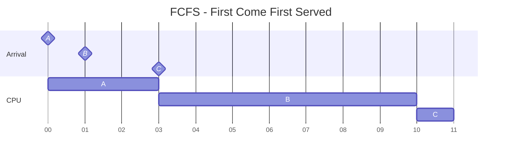
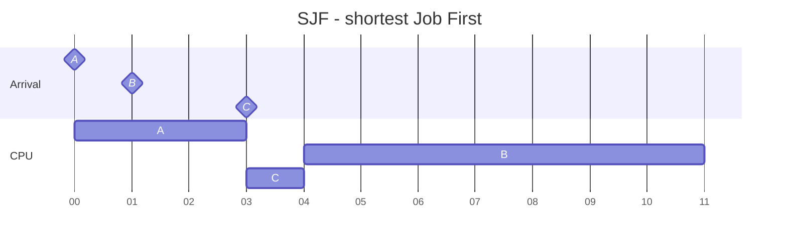
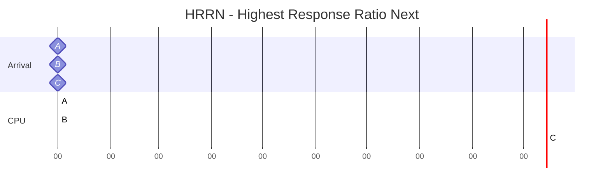
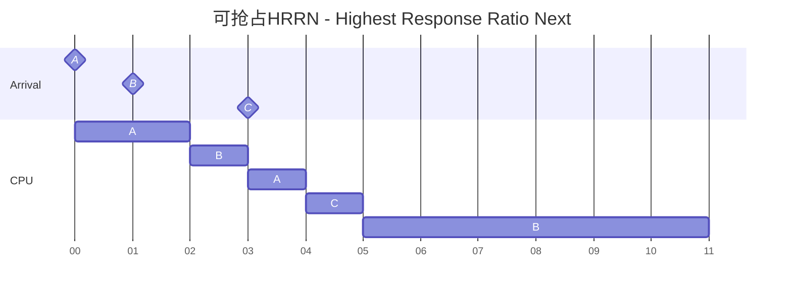
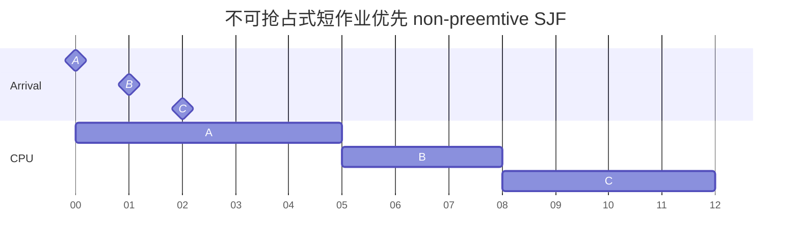
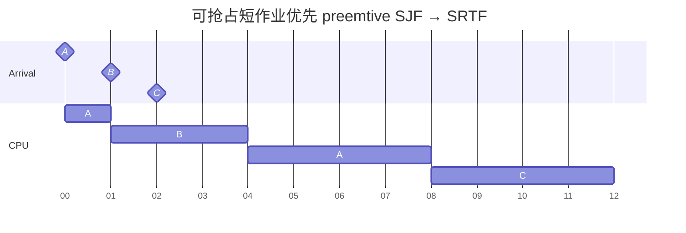
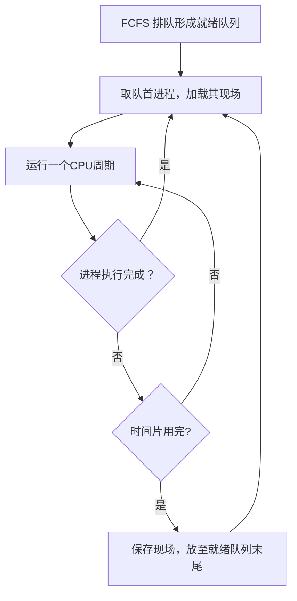
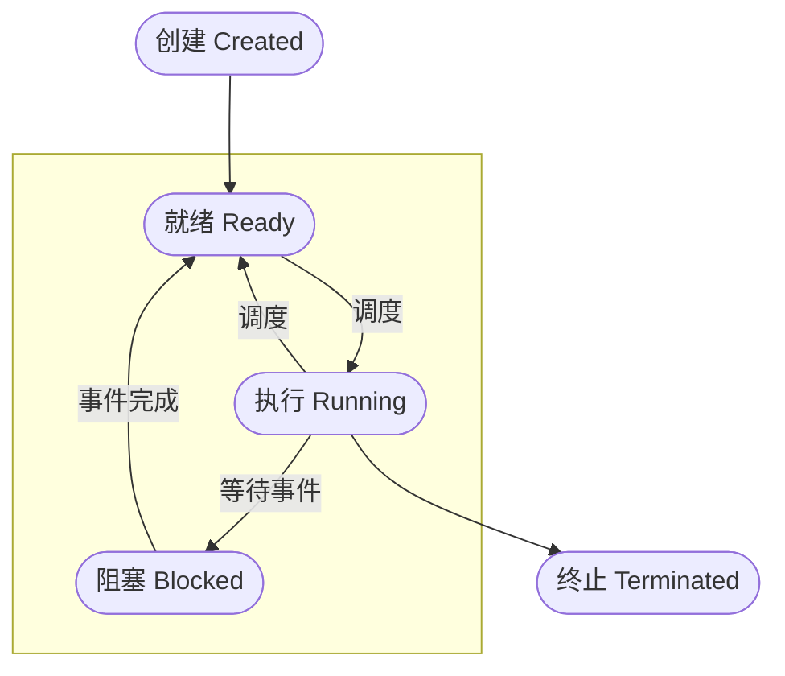
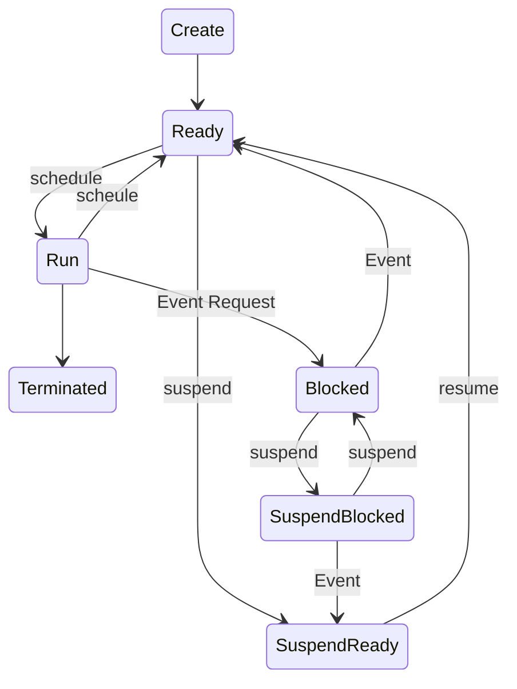
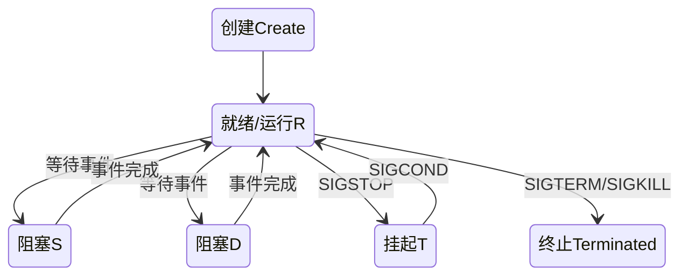

## 第三章  调度

*XSUN@GZHU
2026/09/27*

---
上一章我们介绍的**互斥mutual exclusion**、**同步synchronization**与**死锁deadlock**解决的是单核分时操作系统中进程之间如何正确地**并发concurrecny**，我们这一章要解决的是有限的CPU时间究竟怎样分配给这些进程。

单核 CPU 本身其实也是一个“互斥资源”——任何一个瞬间只能被一个执行流使用。因此，让计算机更美好的操作系统该如何分配CPU时间就是分时操作系统要解决的重要问题。

我们先来看一个简单的例子，现有如下3个作业需要运行：

|作业|到达时间|需要的CPU时间|
|:--:|:--:|:--:|
|A|0|3|
|B|1|7|
|c|3|1|

操作系统该如何分配CPU时间呢？

### 非抢占式作业调度 Non-preemtive Job Scheduling
第一章我们知道，早期批处理系统（Batch System）只能把一个任务 [^1] 执行完再执行下一个任务，也就是后来的任务无法抢占(preempt)先来任务的CPU。

[^1]:为简便，在本章种我们说任务/作业/进程可指同一个意思，一个待CPU执行的程序。若严谨需要区别：任务是较笼统的书法，而作业更针对批处理系统，进程更针对分时操作系统。

#### 先来先服务 - FCFS
银行排队、食堂排队、医院挂号：生活常识告诉我们"先到先得，凡事有个先来后到"的道理，因此，自然的想法的是，先来的进程先得到CPU，这就是First Come First Served-FCFS算法。


这样的调度有什么问题？

C明明很短(需要较少的CPU时间)，却因为 B 在前面，只能一直等。这就是**护航效应(Convoy Effect)**，运行队伍被最长的任务拖住。

所以我们不能只问"公不公平"，还应该问：每个作业等待了多久( $t_w$ , 等待时间waiting time)，或者多久才被CPU执行完成( $t_t$ 周转时间-turnaround time)。

针对上例，计算各个进程的周转时间：

$$t_t = t_c - t_a$$

其中 $t_c$ 为任务完成时间,  $t_a$ 是任务的到达时间，然后再求平均周转时间：

$$\bar{t}_t = \frac{t_t^A + t_t^B + t_t^C}{3} = \frac{(3-0) + (10-1) + (11-3)}{3}\approx6.67$$

由周转时间，我们可以分别计算进程的等待时间：

$$t_w = t_t - t_{CPU}$$，


其中 $t_{CPU}$ 为CPU真正执行该任务所用的时间（在本例中就是程序所需要的服务时间 $t_s$ ），然后计算三个进程的平均等待时间( $\bar{t}_w$ )：

$$\bar{t}_w = \frac{t_w^A + t_w^B + t_w^C}{3} = \frac{(3-3) + (9-7) + (8-1)}{3}=3$$


既然短作业被长作业堵住，那么我们可以让短作业先执行。

#### 短作业优先 - SJF
采取短作业优先Shortest Job First, 则CPU的调度如下图：


我们再来计算平均周转时间：

$$\bar{t}_t = \frac{t_t^A + t_t^B + t_t^C}{3} = \frac{(3-0) + (11-1) + (4-3)}{3}\approx4.67$$

以及平均等待时间：

$$\bar{t}_w = \frac{t_w^A + t_w^B + t_w^C}{3} = \frac{(3-3) + (10-7) + (1-1)}{3}=1$$

平均周转和平均等待时间确实都变小了，这里有一个结论：

>如果所有任务已经到达，并且所需CPU时间已知，非抢占式 SJF 可以最小化平均等待时间。

但是，操作系统要如何知道该进程还需要多少运行时间呢？实际中，OS只能根据该进程的历史行为来预测，可采用指数平均：

$$
\tau_{n+1} = \alpha t_n + (1 - \alpha)\tau_n
$$

其中 $t_n$ 为此次(第 $n$ 次)运行该进程所用的时间，$\tau$ 为对该进程所需要CPU时间的预测。

此外，SJF还有另外一个问题：如果总是短作业优先，那么如果短作业不断到来，长作业就永远得不到CPU，就像一直拿不到筷子的哲学家一样，产生进程 **饥饿(starvation)** 问题。

如何解决呢？可能的想法是，如果一个进程“太饿了”（等待时间过长），就得让他有更高的获得CPU的优先权。

> 注：这种思想叫做老化-Aging。

会面我们还会具体说到。

#### 优先级调度 - Priority Scheduling
我们看到SJF会产生饥饿问题，并且如果长作业非常的重要，一直得不到运行，对整个系统和用户体验都是不好的。因此，操作系统应当允许用户指定任务的优先级，然后按照优先级从高到低来获得CPU。

我们可以把SJF和FCFS都看成是一种特殊的优先级调度：
- FCFS：越先到的作业优先级越高
- SJF：所需CPU时间越短的作业优先级越高

了解了优先级调度后，我们思考如何调整优先级的决定方式以解决FCFS的等待时间长、SJF的饥饿问题呢？

#### 高响应比优先 - HRRN
我们之前提到解决SJF的饥饿问题，可以采用aging的思想: $P \propto t_w$ ，任务优先级正比于其等待时间, 另外还兼顾短作业优先： $P \propto 1/t_s$ ( $t_s$ 为所需要的服务时间，即所需的CPU运行时间)：

$$
P \propto \frac{t_w}{t_s} \to P = 1 + \frac{t_w}{t_s} = \frac{t_w + t_s}{t_s}
$$

上式即为响应比的定义，所以这种动态决定优先级的调度又称为高响应比优先：HRRN，Highest Response Ratio Next.

如果所需服务时间 $t_s$ 很小，那么响应比会增长得很快。因此，HRRN本质上是SJF为了解决饥饿问题，引入Aging后的折中方案。

> 你可能会问为什么是 $1 + t_w/t_s$, 为什么多出这个 $1$ ？有没有这个 $1$ ，算法的调度结果是完全相同的。这个1使得该式的物理意义更明确(服务时间归一化了的周转时间)，可以理解成一个作业所需要的那**1份**服务时间，而后面代表了因为等待引发的惩罚。

对于我们开头的例子，HRRN调度和SJF调度的结果是一样的，因为是非抢占调度，所以调度只发生在A任务执行完之时($t=3$)，此时B和C的响应比：
- $P_B = 1 + \frac{3-1}{7} \approx 1.286$
- $P_C = 1 + \frac{3-3}{1} = 1$

由于 $P_B > P_C$, 所以会先运行B：

可见，新到的任务其响应比为1，一定小于已经等待了的任务。此结果与FCFS相同，仍然有很强的护航效应。实际中，可抢占式调度才能更好地发挥HRRN的优势，因为等待时间一CPU周期


### 抢占式进程调度 Preemptive Process Scheduling
之前所讲的调度都是不可抢占的，一个Job拿到CPU后会执行完才会释放CPU，但如果我们运行CPU被抢占，即在每一个不可分割的单位执行时间后（**CPU周期/时钟中断周期**），都重新决定下一个要执行哪个任务。

比如对于上面的非抢占式HRRN，我们可以改成抢占式HRRN，其调度结果为：


请自行计算 $t=1,2,3,4$ 时刻时各任务的响应比，验证上述调度的正确性！

我们说过分时操作系统的目的是为了提高用户的体验，要做到的是尽量快地对用户程序进行响应。为此，我们使用一个新的评价指标响应时间 $t_r$ 来衡量调度算法的响应性能：

$$t_r = t_b - t_a$$

其中 $t_b$ 为开始执行时间(进程首次获得CPU的时间，也即开始运行的时间),  $t_a$ 是任务的到达时间。若CPU不可抢占，则相应时间就等于等待时间，因为每个进程只会在被执行前等待！

对比不可抢占和可抢占的HRRN，会发现这两种调度的平均响应时间分别为：3和0.67，可抢占式调度可以大大缩短响应时间，提高系统的分时特性。

为了更直观地理解抢占与响应时间，我们拿SJF算法再举一例，现有如下几个任务：

|进程|到达时间|需要的CPU时间|
|:--:|:--:|:--:|
|A|0|5|
|B|1|3|
|c|2|4|

对于，不可抢占的SJF调度如下：


其对应的平均周转时间 turnaround time:

$$\bar{t}_t = \frac{(5-0) + (8-1) + (12-2)}{3}\approx7.33$$

等待时间 waiting time:

$$\bar{t}_w = \frac{(5-5) + (7-3) + (10-4)}{3}\approx3.33$$

响应时间 response time：

$$\bar{t}_r = \frac{(0-0) + (5-1) + (8-2)}{3}\approx3.33$$

发现，等待时间和响应时间确实相等。

但是，如果是可抢占式SJF，每个时间片都会重新计算**当前最短**的任务执行，因此比较的是最短剩余需要执行的时间，因此算法可更名为：SRTF - Shortest Remaining Time First。

#### 最短剩余时间优先 - SRTF
针对上例，该算法的调度图为：


其对应的平均周转时间 turnaround time:

$$\bar{t}_t = \frac{(8-0) + (4-1) + (12-2)}{3}=7$$

等待时间 waiting time:

$$\bar{t}_w = \frac{(8-5) + (3-3) + (10-4)}{3}=3$$

响应时间 response time：

$$\bar{t}_r = \frac{(0-0) + (1-1) + (8-2)}{3}=2$$

可见，相比与不可抢占的SJF，三个时间都缩短了，而且，响应时间不再等于等待时间，而比等待时间短。

和非抢占式SJF一样，SRJF依然会饥饿问题的产生。因此，对于分时操作系统来说，并不是最自然和符合知觉的方式，也不是最小化平均响应时间的方式。

#### 轮转调度 - RR
分时系统进程调度最直觉的解决办法是：每个进程只运行一会，然后把CPU给下一个进程，这就是轮转调度Round Robin-RR。那么，紧接着的问题是，"运行一会"的这个"一会"是多久呢？

我们一般以时间片 $q$ (quantum) 为单位来设定每个进程的运行时间， 比如设定 $q=2$的意思每个进程运行2个CPU时钟周期, 这便是 Time-sharing 的本质！

但是 $q$ 的取值是一种工程取舍，因为：
- $q$ 越小，响应性提升，但是频繁切换开销太大
- $q$ 越大，响应性下降，当 $q \to \infty$ 时便成为FCFS

另一个问题是，各个进程该如何排好队，轮转执行呢？我们可以用一个**就绪队列（ready queue）** 来放置待运行的所有进程。因此，RR算法的流程如下：


有两个问题需要额外注意：
1. 就绪队列是按FCFS形成的，所以系统运行之后来到的进程会放在就绪队列的末尾
2. 若同一时刻，既有新到来的进程，又有进程时间片用完，那么时间片用完的进程放在就绪队列末尾

对于本章开篇的例子，其RR调度的结果如下[^2]：


[^2]:该图是用[python代码](source/analyser.py)生成的（使用mermaid遇到一些限制）。

我们来计算一下该调度结果的三个指标：

平均周转时间 turnaround time:

$$\bar{t}_t = \frac{(12-0) + (9-1) + (11-2)}{3}\approx9.67$$

等待时间 waiting time:

$$\bar{t}_w = \frac{(12-5) + (8-3) + (9-4)}{3}\approx5.67$$

响应时间 response time：

$$\bar{t}_r = \frac{(0-0) + (2-1) + (4-2)}{3}=1$$

相较于SRTF调度，周转时间和等待时间都变长了，但是响应时间短了一倍，可见RR调度极大地提高了计算机的交互性能。

#### 多队列轮转调度 - MLQ
操作系统中可能会同时存在：系统任务，交互程序，批处理任务等等不同的任务，都装在同一个队列中会使得队列很长且不同任务对CPU的需求是不同的。因此，我们可以有多个就绪队列，每个队列：
- 有自己的时间片大小
- 有自己的调度偏好，从而可以有自己的调度算法

然后，对于单核分时操作系统，队列之间可以采用优先级调度。

但是，马上又有问题：谁负责判断一个程序应该进入哪个队列？一个进程也不是永远属于某一种类型。

#### 多级反馈队列 - MLFQ
OS 不知道程序是什么类型，那就观察它怎么使用 CPU。

MLFQ-Multi-level feedback queue的思路是，事先在系统中设定不同的就绪队列(`Q0-Qn`)，每个队列：
- 新到进程在`Q0`用FCFS排队
- 每个队列使用RR调度，但时间片不同（如: `q(Q0)=1, q(Q1)=2...`）
- 每次调度从`Q0`(优先级最高)开始选队首，若`Q0`无进程，则从`Q1`选

如果时间片用完，进程就下沉到时间片更长的就绪队列，所以这个**反馈feedback**体现在：
\[
行为
\rightarrow
观察
\rightarrow
调整调度参数
\rightarrow
再次观察
\]

对于很快用完时间片的进程，说明其实计算密集型，可以下沉到时间片更长的队列中。

对于上例，采用MLFQ的调度结果为：


同样，计算一下该调度结果的三个指标（[程序](source/analyser.py)直接计算）：
```
+---------+---------+-------+--------+------------+---------+----------+
| Process | Arrival | Start | Finish | Turnaround | Waiting | Response |
+---------+---------+-------+--------+------------+---------+----------+
|    A    |    0    |   0   |   11   |     11     |    6    |    0     |
|    B    |    1    |   1   |   7    |     6      |    3    |    0     |
|    C    |    2    |   2   |   12   |     10     |    6    |    0     |
+---------+---------+-------+--------+------------+---------+----------+
| Average |         |       |        |   9.00f    |  5.00f  |  0.00f   |
+---------+---------+-------+--------+------------+---------+----------+
```

可见，MLQF进一步降低了平均响应时间，其本质原因是`Q0`使用了更小的时间片。相比于RR，MLQF更具实际应用的价值，因为其不用工程地决定到底使用多大的时间片，以及如何给进程分类。Windows系统的进程调度(实际上以线程为基本调度单位)就是以MLQF为基础设计和实现的。

但是，我们真的需要给进程分队列吗？Linux给了我们另一套解决思路。

#### 完全公平调度 - CFS
CFS-Completely Fair Scheduler是Linux系统[^3]采用的调度算法，它基于这样的认识：如果有 \(n\) 个同权 runnable tasks，则理想 CPU 好像让每个任务同时以 \(1/n\) 的速度运行。

[^3]: Linux 从 6.6 开始逐步向 EEVDF 转换，它仍然继承“公平分配 CPU”这个核心目标。 参考：[Linux Kernel](https://kernel.org/doc/html/latest/scheduler/sched-eevdf.html?utm_source=chatgpt.com)。

现实 CPU 只能一次运行一个，所以系统记录每个任务获得 CPU 的“**虚拟运行时间-vruntime**”，并按下式更新：

$$
\Delta v = \frac{1024}{w} \Delta t 
$$

$\Delta t $ 为进程的实际运行时间增量，而 $w$ 越大（默认等于1024），`vruntime`增长得越慢，越容易获得更多的CPU时间。调度是选择当前`vruntime`最小的进程进行调度，以使其虚拟CPU时间慢慢追上其他进程，从而确保公平。

Linux系统中，可以使用`nice`命令指定任务的调度优先级：
```bash
nice –n [-20~19] program.sh
renice –n [-20~19] –p pid
```
`nice`的值与 $w$ 的关系：

| Nice | $w$ |
| ---- | ------ |
| -20  | 88761  |
| 0    | 1024   |
| +19  | 15     |

因此，-20具有最高优先级，而+19优先级最低。

### 实时进程调度 Realtime Scheduling
上面所讲的算法主要针对分时操作：关注用户体验，所以平均响应时间是重要指标。而实时操作系统更在乎的是任务要在规定的时间前完成，其控制精度要求更高。比如自动驾驶控制任务：10ms内必须完成。结果调度算法让其11ms时完成，这时即使平均等待时间再低也没有意义！我们的评价指标发生了根本变化。

> 注：实时调度一般都是可抢占的，不然很难保证截止时间前完成

#### 最早截止时间优先 - EDF
一个简单自然的想法是，哪个任务的截止时间最先到，就先执行谁：EDF(earliest deadline first)。比如有如下三个实时任务：

|进程|到达时间|需要的CPU时间|截止时间|
|:--:|:--:|:--:|:--:|
|T1|0|3|7|
|T2|1|2|6|
|T3|2|2|5|

其调度结果为：


图中虚线标出了各个任务的截止时间，发现所有任务都可以在Deadline之前完成。但是考虑如下情况：
```
CPU Tick = 10

A：
deadline = 20
还需要 9 ms CPU

B：
deadline = 15
还需要 1 ms CPU
```
请问此时更应该调度谁来运行更加合理？


#### 最低松弛度优先 - LLF
思考发现：Deadline最近并不一定意味着更紧急，因为任务还需的CPU时间不同。因此，定义松弛度 $L$ (Laxity):

$$L(t) = t_D - (t + t_{rem})$$

其中 $t_D$ 为Deadline时间，$t_{rem}$ 为剩余运行时间。

- $L(t) = 0$：再不执行就来不及了
- $L(t) < 0$：会错过deadline
- $L(t) > 0$：相对松弛，还来得及

调度器每次选择最小松弛的进程来执行，上例采用LLF的调度结果为：


其结果和使用EDF一致。但需要注意，在单核可抢占的约定下，EDF是保证不错过Deadline的最有效调度方法，而LLF是综合考虑了deadline和剩余运行时间的调度方法。此外，两个任务的 laxity 很接近时，优先级可能反复改变，导致上下文切换开销可能很高。

---

### 进程的状态
学习了进程的并发与调度后，我们对第二章所说的程序运行世界又有了更深的认识，前面我们一直在说：“让某进程运行”“让某进程等待”“唤醒某进程”。现在我们要把这些过去被我们当成理所当然的动作拆开看看：OS 到底是怎么做到的。

当我们启动一个程序，它这一生可能经历了什么？通过我们之前的学习，你不难列出：

- 操作系统创建其"运行世界"
- 正在占用CPU执行其指令
- 等待互斥锁 
- 等待条件变量
- 等待用户输入
- 在就绪队列中等待调度
- 执行完成后退出
- ...

因此，我们可以归纳一下进程的状态：执行Running, 就绪Ready, 睡眠，或者我们称之为阻塞Blocked，此外，还有创建Created和终止Terminated。状态之间可以相互转化：


上图即为进程的状态转化图，能够描述进程状态切换的抽象模型。注意：
1. 进程等待的事件完成后不能直接被运行，因为CPU此时在执行别的进程。需进入到就绪队列，等待被调度。
2. 一个已经启动的进程却没有在运行的情况是：被阻塞或在就绪队列中。

但是，若系统里有很多进程，其中某个进程：
- 暂时不重要；
- 很长时间不会被用户使用；
- 出现异常行为，需要管理员检查；
- 系统希望暂时不给它 CPU；
- 或者系统希望释放部分内存压力。

那此进程的状态是什么？我想让它暂时退出正常的运行竞争，但又不想杀死它，可以怎么办？

那就是暂停执行，在操作系统中我们对这种进程进行**挂起Suspend**，从而提升：
1. 系统响应性：挂起后台任务，不和交互任务抢CPU
2. 系统控制的灵活性，提供除了运行/终止外的另一个选项
3. 资源利用率：可以暂时释放挂起进程的资源(比如内存的换入/换出)
4. 系统的稳定性：出错进程可以挂起后冻结现场然后观察分析，然后再决定是恢复还是终止

引入挂起之后，进程的状态只是多了挂起/非挂起吗？显然不是，进程状态还需要结合原本的就绪/阻塞一起来看，因此会有
1. ready + 没有被挂起 $\to$ 活动就绪
2. ready + 被挂起 $\to$ 静止就绪 Suspend Ready
3. blocked + 没有被挂起 $\to$ 活动阻塞
4. ready + 被挂起 $\to$ 静止阻塞 Suspend Blocked

因此，状态转化图变为：

但需要注意的是，这种进程状态转化图是针对之前的操作系统而言的，进入挂起状态的进程的程序与数据都会被从有限的内存中换到外存中去，而现代操作系统应用了虚拟存储技术[^4]，情况并不是这样，处于挂起状态的进程仍然可能留在内存中。

[^4]:学习了存储技术之后就会更理解。

下面，我们来看看现代操作系统Linux对进程状态的管理，一个简单的C程序：
```c
#include <stdio.h>
#include <unistd.h>

int main(void)
{
    printf("PID = %d\n", getpid());

    while (1) {
        printf("working...\n");
        sleep(2);
    }

    return 0;
}
```
我们在Linux中运行编译后的程序，然后：
```bash
ps -o pid,state,comm -p <pid>
```
其中`<pid>`是process idenetity，系统用于识别进程进行的唯一表示(我们已让程序运行时就打印自己的PID)，就像我们的身份证号一样。上述命令用于查看进程信息：
```
    PID S COMMAND
2442757 S process
```
会发现进程的状态是`S`, 也就是Sleeping (BLOCKED)，程序明明在运行，为什么是睡眠? 那是因为C语言`sleep()`函数本身就会阻塞进程，等待定时器时间到来事件。下面，我们执行如下指令：
```bash
kill -STOP 2442757
ps -o pid,state,comm -p 2442757
```
会发现状态变为`T`, 且进程不再打印`working...`，这就是Linux系统对"挂起suspend"语义的实现，它允许外部信号中断某个进程的可运行状态。这里的`kill`命令的本质不是“杀死进程”，而是：**向进程发送一个 signal（信号）。** 至于进程最后是退出、暂停，还是完全忽略这个信号，取决于发送的是什么信号，以及进程如何处理这个信号。我们可以通过：
```bash
kill -l
```
列出Linux系统支持的所有信号。

对于刚才被我们暂定的进程，我们还可以：
```bash
kill -CONT 244757
```
来恢复它，这是Linux对"激活Resume"语义的实现。进程又会会到`S`状态，但这不意味着进程一直都是sleep状态，因为该进程只有在执行`print()`的时候才是占用CPU的`R`状态。我们可以修改下程序：
```c
#include <stdio.h>
#include <unistd.h>

int main(void)
{
    printf("PID = %d\n", getpid());

    while (1) {
        printf("CPU working...\n");

        for (volatile long i = 0; i < 5000000000; ++i) {
        }

        printf("waiting...\n");
        sleep(3);
    }
}
```
然后使用：
```
top -p <pid>
```
就能看到进程状态在`R`和`S`状态之间切换。Linux的`R`状态的含义是：running or runnable(ready)，也就是说把我们理论模型的就绪和运行当成同一种状态[^i]。这是具体工程实现的取舍，Linux设计哲学认为：内核无需区分Ready和Running，调度器来管更合适（调度器本身己有 runqueue + current ）。

[^i]: 教材把“Ready/Running”画成两个状态，是为了描述生命周期；Linux 把它们合成 TASK_RUNNING，因为调度器已经用 runqueue + current 表达了二者的区别。

Linux中的`S`状态是可以被中断的，称为interruptable sleep，还有一种uninterruptable sleep是不可被中断的，标记为`D`状态。处于`D`状态的进程在等待的过程中不能被打断，也即外部不能通过发送暂定信号来阻塞/挂起它，比如进程在等待磁盘读写，如果随意打断可能使得读写出错。

根据以上内容，我们可以终结一下Linux中进程状态的转换：


由此可见，理论模型和工程实现之间具有一定的差距，具体实现需要考虑系统的整体设计。

### 进程控制与PCB
回顾我们已经学过的所有进程相关的内容：
- 运行世界
  - 执行流：栈，寄存器，局部变量
  - 资源，文件，全局变量
  - 内存地址空间
- 身份PID
- 用户：谁创建的这个进程
- 状态：等待时间还是rrady
- 调度信息：时间片
- ...

因此，对于操作系统来说，就可以用一个数据结构来掌握进程的全貌，这个数据包含上面列出的与进程相关的所有信息，我们称之为**进程控制块PCB-Process Control Block.** 因此，一个进程实体(进程印象Process Image)就包含：
1. 存在在内存中的指令与数据
2. 存在在特定内存区域的PCB

在PCB中记录指令和程序的位置，就能找到进程的执行现场。因此PCB包含了操作系统需要控制进程所需要的全部信息！可以用C语言结构体定义一个PCB:
```c
typedef struct mm_struct {
    uint64_t start_code, end_code;   // 代码段（文本段）地址
    uint64_t start_data, end_data;   // 数据段地址
    uint64_t start_brk, brk;         // 堆的起始与当前边界（brk系统调用指针）
    uint64_t start_stack;            // 栈的基地址（用户栈）
    int refcount;                    // 引用计数：有多少个线程正在共享此内存空间
} mm_struct;

typedef struct files_struct {
    void* fd_array[MAX_FILES];       // 模拟文件描述符数组
    int count;                       // 引用计数
} files_struct;


typedef struct thread_struct {
    uint64_t rsp;                    // 栈指针寄存器
    uint64_t rip;                    // 指令指针寄存器 (PC)
    uint64_t rax;                    // 通用寄存器
    uint64_t rbx;
} thread_struct;

typedef struct PCB {
    // 进程/线程标识
    int pid;                     
    long state;                      
    // 调度信息
    int prio;                                  
    uint64_t policy;                 
    mm_struct* mm;                
    files_struct* files;
    // 执行流-上下文切换
    thread_struct thread;
} PCB;
```
在任何现代操作系统中都有类似的代码，虽然可能具体字段的定义和内容不同，但都需要PCB这一数据结构来实现对进程的控制。

在Linux系统中采用的是`task_struct`，我们可以通过：
```bash
cat /proc/<pid>/status
```
`/proc`文件来查看内核暴露给我们的进程信息，你会看到如下信息：
```
Name:   bash
Umask:  0022
State:  S (sleeping)
Tgid:   1693
Ngid:   0
Pid:    1693
PPid:   1680
…
VmRSS:      5920 kB
RssAnon:            2400 kB
…
VmData:     2396 kB
VmStk:       132 kB
VmExe:       892 kBV
…
Threads:        1
SigQ:   1/47285
SigPnd: 0000000000000000
ShdPnd: 0000000000000000
…
voluntary_ctxt_switches:   1088
nonvoluntary_ctxt_switches:     0
```
对应了Linux对进程管理数据结构的相应字段。

---


至此，我们第三章就结束了。我们对操作系统让计算机更美好，又有了更深的理解。这两章主要强调OS对计算机CPU(硬件)和进程(软件)的管理，下一章我们将学习OS如何对计算机的内存进行管理。
